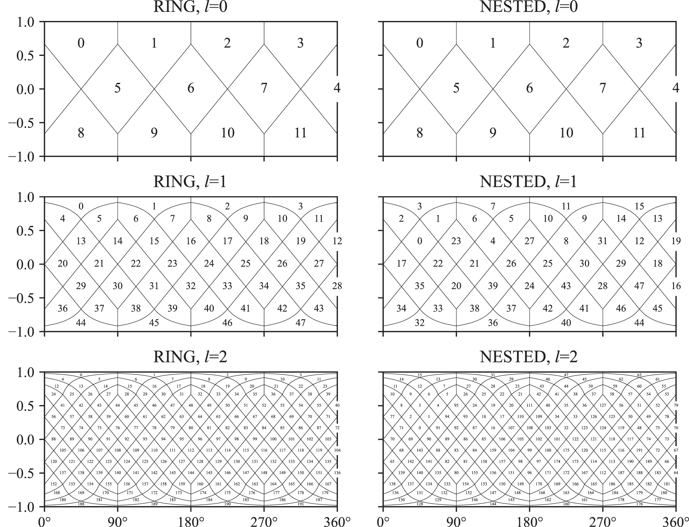

# Healpix Software Maturity

### Why do we want to use a ‘trei’? (possibly too much detail)

For data assimilation and integration (i.e., harmonization and comparison), we
need a way to index and query that data when performing aggregation.

One option for this is completely unstructured— i.e., build a spatial index
(like a kd-tree) on all of the data, and then use that spatial structure (via
queries) to aggregate to an arbitrary output. This isn’t remotely computational
at scale, since we have to *explicitly* store the coordinate values of each
data point/cell, and our data is large.

Another option is to use a grid. The question quickly becomes ‘what grid’, and
the answer invariably has some hard compromises in terms of grid alignment,
resolution, and figuring out something that works at all in the polar regions.

Regular tessellation gives us a hybrid of the two approaches above that keeps
most of the good that we want from each, while jettisoning some of the
problems. A regular tessellation gives a tree structure, but since the
tessellation is regular we execute the ‘splits’ of the tree in the embedding
space in a predictable way and don’t need to store any coordinates— this is
called a ‘trei’ to distinguish it from the irregular ‘tree’ structure that is
associated with spatial index tree. At each level of the trei, we have a grid;
so we have multiple resolutions for different types and density of data.

Basically, we commit to a family of grids that always align, and encode a range
of discrete resolutions (rather than a continuous range of *any* resolution).
Because the trei/tree structure is implicit, we can execute spatial search and
retrieval independent of the data itself efficiently (and on the client.)

The major reason is so we can do hive-like spatial sharding of data tiles in
S3. That and human friendly spatial operators for things like coarsening and
checking for data overlap.

### Why Healpix, why not something else?

In the spirit of transparency, there are two other competing ‘trei’ structures
that are mature, performant, and do much of what we want.

1. **S3** is what google earth uses, and is a competing tessellation of
   slightly curved rectangular pixels. There’s a lot going for it, but it has
   one property that is very likely a deal breaker for us— it’s **not** equal area
   (i.e., cells at a given resolution can differ in area up to 1.4x). For
   model-data, model-model, and data-data comparisons, we’ll constantly be doing
   aggregations, and not having equal area massively raises our complexity!
2. **H3** is developed by Uber, and is another competing tessellation that **is
   equal area**, and is well supported in software. However, H3 defines a
   hexagonal tessellation (i.e., a soccer ball), which loses a huge portion of the
   scientific stack— i.e., numpy, and everything that builds on it. While we could
   still use it to describe an apache-hive-like hierarchy of data files (files
   which could themselves be rectangular gridded), it’s a hassle to pack
   rectilinear grids into hexagonal buckets.

### Core Healpix concepts

Healpix defines two ‘orderings’:

1. **Ring** is the default; it’s latitude ordered, and is compatible with spherical harmonic transforms/analytics, which was a core design requirement for astronomy community when they scoped and adopted healpix.
2. **Nested** is what we’re interested in, and defines a space filling curve such that adjacent pixels are close in the index space.
    - Within nested, is where we get the multi-resolution maps.
        - Morton indexing lives as an extension to multi-resolution maps.

The Multi-resolution maps are called Multi-Order Coverage maps (’MOC’); standard is [defined here](https://ivoa.net/documents/MOC/) 

## State of Healpix software

The core healpix JPL libraries have been stable for over a decade now, but I was surprised to find out just how mature the multi-resolution map coverage has gotten. I had claude put together a summary doc based on some exploratory searches, which you can peruse here:

[healpix_links](../reference/healpix_links.md)

The best link from the above doc is probably the [awesome-HEALPix]([https://github.com/pangeo-data/awesome-HEALPix](https://github.com/pangeo-data/awesome-HEALPix)) meta-repository. 

I’ll summarize what we care about in terms of maturity, in rough order of importance:

1. Native integration into xarray [via xdggs](https://github.com/xarray-contrib/xdggs). The xdggs isn’t at a ‘stable’ release quite yet, but it looks mature enough to be used in production already. They have a very active user community, and it’s worth reading through their [design doc](https://github.com/xarray-contrib/xdggs/blob/main/design_doc.md) which should inform how we think about our own development best practices. Integration with xarray gets us:
    1. [Native plotting, resampling, etc](https://xdggs.readthedocs.io/en/latest/tutorials/healpix.html)
    2. Also includes support for [convolutions that are healpix aware](https://healpix-convolution.readthedocs.io/en/latest/user-guide/xarray.html)
    3. Native compatibility with Zarr (through xarray)
    4. Compatibility with the **Nested** healpix indexing; the maintainers don’t want mixed resolutions within a single array…but that doesn’t restrict us from using a MOC indexing scheme. 
        1. Already see some [multi-resolution healpix examples](https://xhealpixify.readthedocs.io/en/latest/notebook.html) in smaller libraries
    5. Working toward integration as an official [OGC API / Spec / Standard](https://github.com/opengeospatial/ogcapi-discrete-global-grid-systems)
2. There’s also support for **unstructured** healpix grids in xarray via [UXarray](https://github.com/UXARRAY/uxarray)
    1. Climate focused project, so adhering and working toward CF-compliance
        1. Built on [UGRID](https://ugrid-conventions.github.io/ugrid-conventions/)
        2. Separate discussion of [creating healpix parameters in the CF spec itself](https://github.com/cf-convention/cf-conventions/issues/433) 
3. Lots of Rust support, which is our bridge to WASM (web assembly) for fully client side loading in the browser:
    1. This specific Multi-Resolution / [MOC rust library](https://github.com/cds-astro/cds-moc-rust) for both reading and displaying
        1. WASM portion [here](https://github.com/cds-astro/cds-moc-rust/tree/main/crates/wasm)
        2. [Example](https://virgo.pg.infn.it/maps/index.html) of a live page using it (zoom in to see the data tiling structure)
        3. [This tool](http://cdsxmatch.u-strasbg.fr/), which I think is basically our [model data comparison project that’s already been done](http://cdsxmatch.u-strasbg.fr/xmatch/doc/service-overview.html) within the astro community
    2. Another [rust library](https://github.com/cds-astro/cds-healpix-rust) with broad use…
    3. [Another one](https://github.com/matt-cornell/healpix-rs) refactored for cleaner API
4. Plotting support for MOCs:
    1. [mocpy](https://github.com/cds-astro/mocpy) , with lots [more documentation](https://cds-astro.github.io/mocpy/examples/user_documentation.html#smoc-a-k-a-moc-spatial-coverages)
        1. more examples [here](https://cds-astro.github.io/mocpy/_collections/notebooks/01-Creating_MOCs_from_shapes.html)
    2. [mhealpy](https://gitlab.com/burstcube/mhealpy) (which is what I’ve previously used)
        1. Examples [here](https://mhealpy.readthedocs.io/en/latest/tutorials/LIGO_IO_Resampling.html#Single-to-multi-resolution), and [here](https://mhealpy.readthedocs.io/en/latest/tutorials/LIGO_IO_Resampling.html#Resampling-multi-resolution-maps)
        2. maintained by Aaron’s friend
5. Healpix native ML support:
    1. [HealpixML](https://github.com/jmdelouis/HealpixML)
    2. https://github.com/jmdelouis/HealpixML
6. Other packages:
    1. python bindings at [healpy](https://github.com/healpy/healpy)
    2. native plotting and other support in [vaex](https://vaex.readthedocs.io/en/latest/guides/advanced_plotting.html#Plotting-a-healpix-map) 
        1. Great for density mapping of data / observations
    3. all the other libraries referenced in:

        [healpix_links](../reference/healpix_links.md)
        
